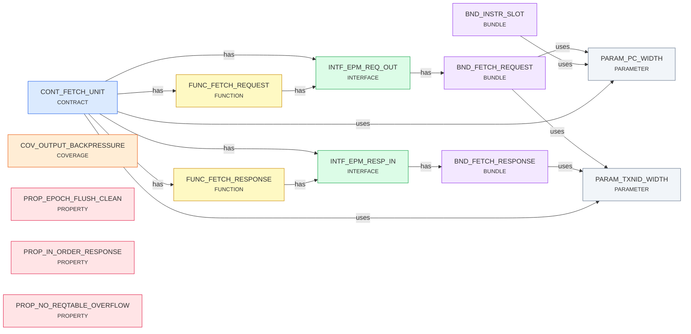

# Spec Report

> 14 specs · 8 bindings · generated by `SpecCheck`

## Coverage

| metric | value |
|---|---|
| Implementation (structural ↔ tag) | 5 / 5 ✅ |
| Formal (property ↔ check) | 3 / 4 ⚠️ |
| Typed bundle completeness | 2 / 3 ⚠️ |
| Dangling references | 0 ✅ |

## Graph

## BUNDLE

### BND_FETCH_REQUEST

EPM fetch request

- **uses** → [PARAM_PC_WIDTH](#param_pc_width), [PARAM_TXNID_WIDTH](#param_txnid_width)

| Field | Type |
|---|---|
| addr | UInt |
| txnId | UInt |

### BND_FETCH_RESPONSE

EPM fetch response

- **uses** → [PARAM_TXNID_WIDTH](#param_txnid_width)

| Field | Type |
|---|---|
| data | UInt |
| txnId | UInt |
| eccOK | Bool |

### BND_INSTR_SLOT

Issued instruction slot

- **uses** → [PARAM_PC_WIDTH](#param_pc_width)

| Field | Type |
|---|---|
| instruction | UInt |
| pc | UInt |

> _undeclared-fields: valid_

## CONTRACT

### CONT_FETCH_UNIT

Fetch unit: issues memory requests and tracks responses

- **has** → [FUNC_FETCH_REQUEST](#func_fetch_request), [FUNC_FETCH_RESPONSE](#func_fetch_response), [INTF_EPM_REQ_OUT](#intf_epm_req_out), [INTF_EPM_RESP_IN](#intf_epm_resp_in)
- **uses** → [PARAM_PC_WIDTH](#param_pc_width), [PARAM_TXNID_WIDTH](#param_txnid_width)

- 🔗 **RTL:** `FetchUnit.scala:19`

## COVERAGE

### COV_OUTPUT_BACKPRESSURE

The output is back-pressured at least once

- ✅ **covered:** `reqCount > respCount` _(FetchUnit.scala:52)_

## FUNCTION

### FUNC_FETCH_REQUEST

Generate aligned fetch requests, allocate txn entry

- **has** → [INTF_EPM_REQ_OUT](#intf_epm_req_out)

- 🔗 **RTL:** `FetchUnit.scala:35`

### FUNC_FETCH_RESPONSE

Match response txn, forward data, deallocate entry

- **has** → [INTF_EPM_RESP_IN](#intf_epm_resp_in)

- 🔗 **RTL:** `FetchUnit.scala:41`

## INTERFACE

### INTF_EPM_REQ_OUT

Fetch request output to external program memory

- **has** → [BND_FETCH_REQUEST](#bnd_fetch_request)

- 🔗 **RTL:** `FetchUnit.scala:23`

### INTF_EPM_RESP_IN

Fetch response input from external program memory

- **has** → [BND_FETCH_RESPONSE](#bnd_fetch_response)

- 🔗 **RTL:** `FetchUnit.scala:26`

## PARAMETER

### PARAM_PC_WIDTH

Program counter width in bits

| Key | Value |
|---|---|
| default | 32 |

### PARAM_TXNID_WIDTH

Transaction id width for outstanding fetches

| Key | Value |
|---|---|
| default | 1 |

## PROPERTY

### PROP_EPOCH_FLUSH_CLEAN

An epoch flush clears every outstanding entry

- ⚠️ **not enforced by any check**

### PROP_IN_ORDER_RESPONSE

Responses are consumed in request order

- ✅ **asserted:** `respCount <= reqCount` _(FetchUnit.scala:51)_

### PROP_NO_REQTABLE_OVERFLOW

Outstanding requests never exceed table size

- ✅ **asserted:** `(reqCount - respCount) <= maxOutstanding` _(FetchUnit.scala:50)_

