# Spec Report

> 44 specs · 32 bindings · generated by `SpecCheck`

## Coverage

| metric | value |
|---|---|
| Implementation (structural ↔ tag) | 24 / 24 ✅ |
| Formal (property ↔ check) | 8 / 8 ✅ |
| Typed bundle completeness | 4 / 4 ✅ |
| Dangling references | 0 ✅ |

## Graph

```mermaid
graph LR
  BND_PACKET_META["BND_PACKET_META<br/><small>BUNDLE</small>"]:::catBUNDLE
  BND_RULE_ACTION["BND_RULE_ACTION<br/><small>BUNDLE</small>"]:::catBUNDLE
  BND_STREAM_BEAT["BND_STREAM_BEAT<br/><small>BUNDLE</small>"]:::catBUNDLE
  BND_TAGGED_BEAT["BND_TAGGED_BEAT<br/><small>BUNDLE</small>"]:::catBUNDLE
  CONT_CLASSIFIER["CONT_CLASSIFIER<br/><small>CONTRACT</small>"]:::catCONTRACT
  CONT_EGRESS_BUFFER["CONT_EGRESS_BUFFER<br/><small>CONTRACT</small>"]:::catCONTRACT
  CONT_FRAMER["CONT_FRAMER<br/><small>CONTRACT</small>"]:::catCONTRACT
  CONT_INGRESS_BUFFER["CONT_INGRESS_BUFFER<br/><small>CONTRACT</small>"]:::catCONTRACT
  CONT_SHAPER["CONT_SHAPER<br/><small>CONTRACT</small>"]:::catCONTRACT
  CONT_STREAM_PROCESSOR["CONT_STREAM_PROCESSOR<br/><small>CONTRACT</small>"]:::catCONTRACT
  COV_BACKPRESSURE["COV_BACKPRESSURE<br/><small>COVERAGE</small>"]:::catCOVERAGE
  COV_PACKET_DROP["COV_PACKET_DROP<br/><small>COVERAGE</small>"]:::catCOVERAGE
  COV_TOKENS_DRAINED["COV_TOKENS_DRAINED<br/><small>COVERAGE</small>"]:::catCOVERAGE
  FUNC_CLASSIFY["FUNC_CLASSIFY<br/><small>FUNCTION</small>"]:::catFUNCTION
  FUNC_DROP_FILTER["FUNC_DROP_FILTER<br/><small>FUNCTION</small>"]:::catFUNCTION
  FUNC_ELASTIC_BUFFER["FUNC_ELASTIC_BUFFER<br/><small>FUNCTION</small>"]:::catFUNCTION
  FUNC_FRAMING["FUNC_FRAMING<br/><small>FUNCTION</small>"]:::catFUNCTION
  FUNC_PIPELINE["FUNC_PIPELINE<br/><small>FUNCTION</small>"]:::catFUNCTION
  FUNC_RATE_LIMIT["FUNC_RATE_LIMIT<br/><small>FUNCTION</small>"]:::catFUNCTION
  INTF_CLASSIFIER_IN["INTF_CLASSIFIER_IN<br/><small>INTERFACE</small>"]:::catINTERFACE
  INTF_CLASSIFIER_OUT["INTF_CLASSIFIER_OUT<br/><small>INTERFACE</small>"]:::catINTERFACE
  INTF_EGRESS_IN["INTF_EGRESS_IN<br/><small>INTERFACE</small>"]:::catINTERFACE
  INTF_EGRESS_OUT["INTF_EGRESS_OUT<br/><small>INTERFACE</small>"]:::catINTERFACE
  INTF_FRAMER_IN["INTF_FRAMER_IN<br/><small>INTERFACE</small>"]:::catINTERFACE
  INTF_FRAMER_OUT["INTF_FRAMER_OUT<br/><small>INTERFACE</small>"]:::catINTERFACE
  INTF_INGRESS_IN["INTF_INGRESS_IN<br/><small>INTERFACE</small>"]:::catINTERFACE
  INTF_INGRESS_OUT["INTF_INGRESS_OUT<br/><small>INTERFACE</small>"]:::catINTERFACE
  INTF_SHAPER_IN["INTF_SHAPER_IN<br/><small>INTERFACE</small>"]:::catINTERFACE
  INTF_SHAPER_OUT["INTF_SHAPER_OUT<br/><small>INTERFACE</small>"]:::catINTERFACE
  INTF_STREAM_IN["INTF_STREAM_IN<br/><small>INTERFACE</small>"]:::catINTERFACE
  INTF_STREAM_OUT["INTF_STREAM_OUT<br/><small>INTERFACE</small>"]:::catINTERFACE
  PARAM_DATA_BYTES["PARAM_DATA_BYTES<br/><small>PARAMETER</small>"]:::catPARAMETER
  PARAM_DEST_WIDTH["PARAM_DEST_WIDTH<br/><small>PARAMETER</small>"]:::catPARAMETER
  PARAM_EGRESS_DEPTH["PARAM_EGRESS_DEPTH<br/><small>PARAMETER</small>"]:::catPARAMETER
  PARAM_HEADER_BYTES["PARAM_HEADER_BYTES<br/><small>PARAMETER</small>"]:::catPARAMETER
  PARAM_ID_WIDTH["PARAM_ID_WIDTH<br/><small>PARAMETER</small>"]:::catPARAMETER
  PARAM_INGRESS_DEPTH["PARAM_INGRESS_DEPTH<br/><small>PARAMETER</small>"]:::catPARAMETER
  PARAM_NUM_RULES["PARAM_NUM_RULES<br/><small>PARAMETER</small>"]:::catPARAMETER
  PARAM_SHAPER_BURST["PARAM_SHAPER_BURST<br/><small>PARAMETER</small>"]:::catPARAMETER
  PROP_ACTION_STABLE["PROP_ACTION_STABLE<br/><small>PROPERTY</small>"]:::catPROPERTY
  PROP_DROPPED_NOT_EMITTED["PROP_DROPPED_NOT_EMITTED<br/><small>PROPERTY</small>"]:::catPROPERTY
  PROP_NO_BEAT_LOSS["PROP_NO_BEAT_LOSS<br/><small>PROPERTY</small>"]:::catPROPERTY
  PROP_SOP_EOP_BALANCED["PROP_SOP_EOP_BALANCED<br/><small>PROPERTY</small>"]:::catPROPERTY
  PROP_TOKEN_BOUNDED["PROP_TOKEN_BOUNDED<br/><small>PROPERTY</small>"]:::catPROPERTY
  BND_RULE_ACTION -->|uses| PARAM_DEST_WIDTH
  BND_STREAM_BEAT -->|uses| PARAM_DATA_BYTES
  BND_STREAM_BEAT -->|uses| PARAM_DEST_WIDTH
  BND_STREAM_BEAT -->|uses| PARAM_ID_WIDTH
  CONT_CLASSIFIER -->|has| FUNC_CLASSIFY
  CONT_CLASSIFIER -->|has| INTF_CLASSIFIER_IN
  CONT_CLASSIFIER -->|has| INTF_CLASSIFIER_OUT
  CONT_CLASSIFIER -->|uses| PARAM_DEST_WIDTH
  CONT_CLASSIFIER -->|uses| PARAM_NUM_RULES
  CONT_EGRESS_BUFFER -->|has| FUNC_DROP_FILTER
  CONT_EGRESS_BUFFER -->|has| INTF_EGRESS_IN
  CONT_EGRESS_BUFFER -->|has| INTF_EGRESS_OUT
  CONT_EGRESS_BUFFER -->|uses| PARAM_DATA_BYTES
  CONT_EGRESS_BUFFER -->|uses| PARAM_EGRESS_DEPTH
  CONT_FRAMER -->|has| FUNC_FRAMING
  CONT_FRAMER -->|has| INTF_FRAMER_IN
  CONT_FRAMER -->|has| INTF_FRAMER_OUT
  CONT_INGRESS_BUFFER -->|has| FUNC_ELASTIC_BUFFER
  CONT_INGRESS_BUFFER -->|has| INTF_INGRESS_IN
  CONT_INGRESS_BUFFER -->|has| INTF_INGRESS_OUT
  CONT_INGRESS_BUFFER -->|uses| PARAM_DATA_BYTES
  CONT_INGRESS_BUFFER -->|uses| PARAM_INGRESS_DEPTH
  CONT_SHAPER -->|has| FUNC_RATE_LIMIT
  CONT_SHAPER -->|has| INTF_SHAPER_IN
  CONT_SHAPER -->|has| INTF_SHAPER_OUT
  CONT_SHAPER -->|uses| PARAM_SHAPER_BURST
  CONT_STREAM_PROCESSOR -->|has| CONT_CLASSIFIER
  CONT_STREAM_PROCESSOR -->|has| CONT_EGRESS_BUFFER
  CONT_STREAM_PROCESSOR -->|has| CONT_FRAMER
  CONT_STREAM_PROCESSOR -->|has| CONT_INGRESS_BUFFER
  CONT_STREAM_PROCESSOR -->|has| CONT_SHAPER
  CONT_STREAM_PROCESSOR -->|has| FUNC_PIPELINE
  CONT_STREAM_PROCESSOR -->|has| INTF_STREAM_IN
  CONT_STREAM_PROCESSOR -->|has| INTF_STREAM_OUT
  CONT_STREAM_PROCESSOR -->|uses| PARAM_DATA_BYTES
  CONT_STREAM_PROCESSOR -->|uses| PARAM_DEST_WIDTH
  CONT_STREAM_PROCESSOR -->|uses| PARAM_HEADER_BYTES
  CONT_STREAM_PROCESSOR -->|uses| PARAM_NUM_RULES
  CONT_STREAM_PROCESSOR -->|uses| PARAM_SHAPER_BURST
  FUNC_CLASSIFY -->|has| BND_RULE_ACTION
  FUNC_CLASSIFY -->|has| INTF_CLASSIFIER_IN
  FUNC_CLASSIFY -->|has| INTF_CLASSIFIER_OUT
  FUNC_CLASSIFY -->|uses| PARAM_NUM_RULES
  FUNC_DROP_FILTER -->|has| INTF_EGRESS_IN
  FUNC_DROP_FILTER -->|has| INTF_EGRESS_OUT
  FUNC_DROP_FILTER -->|uses| PARAM_EGRESS_DEPTH
  FUNC_ELASTIC_BUFFER -->|has| INTF_INGRESS_IN
  FUNC_ELASTIC_BUFFER -->|has| INTF_INGRESS_OUT
  FUNC_ELASTIC_BUFFER -->|uses| PARAM_INGRESS_DEPTH
  FUNC_FRAMING -->|has| INTF_FRAMER_IN
  FUNC_FRAMING -->|has| INTF_FRAMER_OUT
  FUNC_PIPELINE -->|has| INTF_STREAM_IN
  FUNC_PIPELINE -->|has| INTF_STREAM_OUT
  FUNC_RATE_LIMIT -->|has| INTF_SHAPER_IN
  FUNC_RATE_LIMIT -->|has| INTF_SHAPER_OUT
  FUNC_RATE_LIMIT -->|uses| PARAM_SHAPER_BURST
  INTF_CLASSIFIER_IN -->|has| BND_TAGGED_BEAT
  INTF_CLASSIFIER_OUT -->|has| BND_TAGGED_BEAT
  INTF_EGRESS_IN -->|has| BND_TAGGED_BEAT
  INTF_EGRESS_OUT -->|has| BND_STREAM_BEAT
  INTF_FRAMER_IN -->|has| BND_STREAM_BEAT
  INTF_FRAMER_OUT -->|has| BND_TAGGED_BEAT
  INTF_INGRESS_IN -->|has| BND_STREAM_BEAT
  INTF_INGRESS_OUT -->|has| BND_STREAM_BEAT
  INTF_SHAPER_IN -->|has| BND_TAGGED_BEAT
  INTF_SHAPER_OUT -->|has| BND_TAGGED_BEAT
  INTF_STREAM_IN -->|has| BND_STREAM_BEAT
  INTF_STREAM_OUT -->|has| BND_STREAM_BEAT
  classDef catCONTRACT fill:#dbeafe,stroke:#2563eb
  classDef catINTERFACE fill:#dcfce7,stroke:#16a34a
  classDef catFUNCTION fill:#fef9c3,stroke:#ca8a04
  classDef catBUNDLE fill:#f3e8ff,stroke:#9333ea
  classDef catPARAMETER fill:#f1f5f9,stroke:#64748b
  classDef catPROPERTY fill:#ffe4e6,stroke:#e11d48
  classDef catCOVERAGE fill:#ffedd5,stroke:#ea580c
```

## BUNDLE

### BND_PACKET_META

Per-beat metadata derived by the pipeline (framing + classifier verdict)

| Field | Type |
|---|---|
| sop | sop |
| eop | eop |
| drop | drop |
| prio | prio |

### BND_RULE_ACTION

Classifier verdict: drop / redirect / set priority

- **uses** → [PARAM_DEST_WIDTH](#param_dest_width)

| Field | Type |
|---|---|
| drop | drop |
| setDest | setDest |
| newDest | newDest |
| prio | prio |

### BND_STREAM_BEAT

AXI-Stream beat: data + byte-enables + end-of-packet framing + routing tags

- **uses** → [PARAM_DATA_BYTES](#param_data_bytes), [PARAM_DEST_WIDTH](#param_dest_width), [PARAM_ID_WIDTH](#param_id_width)

| Field | Type |
|---|---|
| data | data |
| keep | keep |
| last | last |
| id | id |
| dest | dest |

### BND_TAGGED_BEAT

A beat paired with its metadata — the unit that flows between stages

| Field | Type |
|---|---|
| beat | beat |
| meta | meta |

## CONTRACT

### CONT_CLASSIFIER

Table-driven packet classifier producing a per-packet action

- **has** → [FUNC_CLASSIFY](#func_classify), [INTF_CLASSIFIER_IN](#intf_classifier_in), [INTF_CLASSIFIER_OUT](#intf_classifier_out)
- **uses** → [PARAM_DEST_WIDTH](#param_dest_width), [PARAM_NUM_RULES](#param_num_rules)

- 🔗 **RTL:** `Classifier.scala:10`

### CONT_EGRESS_BUFFER

Applies the classifier verdict and buffers the egress stream

- **has** → [FUNC_DROP_FILTER](#func_drop_filter), [INTF_EGRESS_IN](#intf_egress_in), [INTF_EGRESS_OUT](#intf_egress_out)
- **uses** → [PARAM_DATA_BYTES](#param_data_bytes), [PARAM_EGRESS_DEPTH](#param_egress_depth)

- 🔗 **RTL:** `EgressBuffer.scala:10`

### CONT_FRAMER

Annotates the stream with packet framing metadata

- **has** → [FUNC_FRAMING](#func_framing), [INTF_FRAMER_IN](#intf_framer_in), [INTF_FRAMER_OUT](#intf_framer_out)

- 🔗 **RTL:** `Framer.scala:10`

### CONT_INGRESS_BUFFER

Per-input elastic FIFO providing backpressure and rate decoupling

- **has** → [FUNC_ELASTIC_BUFFER](#func_elastic_buffer), [INTF_INGRESS_IN](#intf_ingress_in), [INTF_INGRESS_OUT](#intf_ingress_out)
- **uses** → [PARAM_DATA_BYTES](#param_data_bytes), [PARAM_INGRESS_DEPTH](#param_ingress_depth)

- 🔗 **RTL:** `IngressBuffer.scala:10`

### CONT_SHAPER

Optional token-bucket rate shaper (instantiated when enableShaper = true)

- **has** → [FUNC_RATE_LIMIT](#func_rate_limit), [INTF_SHAPER_IN](#intf_shaper_in), [INTF_SHAPER_OUT](#intf_shaper_out)
- **uses** → [PARAM_SHAPER_BURST](#param_shaper_burst)

- 🔗 **RTL:** `Shaper.scala:10`
> _Configurable: omitted entirely from the pipeline when disabled_

### CONT_STREAM_PROCESSOR

Configurable AXI-Stream packet-processing pipeline (top)

- **has** → [CONT_CLASSIFIER](#cont_classifier), [CONT_EGRESS_BUFFER](#cont_egress_buffer), [CONT_FRAMER](#cont_framer), [CONT_INGRESS_BUFFER](#cont_ingress_buffer), [CONT_SHAPER](#cont_shaper), [FUNC_PIPELINE](#func_pipeline), [INTF_STREAM_IN](#intf_stream_in), [INTF_STREAM_OUT](#intf_stream_out)
- **uses** → [PARAM_DATA_BYTES](#param_data_bytes), [PARAM_DEST_WIDTH](#param_dest_width), [PARAM_HEADER_BYTES](#param_header_bytes), [PARAM_NUM_RULES](#param_num_rules), [PARAM_SHAPER_BURST](#param_shaper_burst)

- 🔗 **RTL:** `StreamProcessorTop.scala:10`
> _Modular: each stage is its own contract; the shaper stage is optional._

## COVERAGE

### COV_BACKPRESSURE

The ingress FIFO fills and back-pressures upstream at least once

- ✅ **covered:** `in.valid && !in.ready` _(IngressBuffer.scala:18)_

### COV_PACKET_DROP

At least one packet is dropped by the classifier verdict

- ✅ **covered:** `in.fire && in.bits.meta.drop` _(EgressBuffer.scala:18)_

### COV_TOKENS_DRAINED

The shaper runs out of tokens and throttles the stream at least once

- ✅ **covered:** `tokens === UInt(0)` _(Shaper.scala:19)_

## FUNCTION

### FUNC_CLASSIFY

On SOP, match the packet's TDEST against the rule table and latch the resulting action for the whole packet

- **has** → [BND_RULE_ACTION](#bnd_rule_action), [INTF_CLASSIFIER_IN](#intf_classifier_in), [INTF_CLASSIFIER_OUT](#intf_classifier_out)
- **uses** → [PARAM_NUM_RULES](#param_num_rules)

- 🔗 **RTL:** `Classifier.scala:16`
> _First-match wins; no match ⇒ pass-through (no drop, no redirect)_

### FUNC_DROP_FILTER

Discard beats of packets marked drop; apply the redirected TDEST; buffer the rest to the output

- **has** → [INTF_EGRESS_IN](#intf_egress_in), [INTF_EGRESS_OUT](#intf_egress_out)
- **uses** → [PARAM_EGRESS_DEPTH](#param_egress_depth)

- 🔗 **RTL:** `EgressBuffer.scala:16`

### FUNC_ELASTIC_BUFFER

Absorb bursts and decouple upstream/downstream rates via a FIFO; never drop an accepted beat

- **has** → [INTF_INGRESS_IN](#intf_ingress_in), [INTF_INGRESS_OUT](#intf_ingress_out)
- **uses** → [PARAM_INGRESS_DEPTH](#param_ingress_depth)

- 🔗 **RTL:** `IngressBuffer.scala:16`

### FUNC_FRAMING

Derive start-of-packet / end-of-packet from TLAST and attach it as metadata to each beat

- **has** → [INTF_FRAMER_IN](#intf_framer_in), [INTF_FRAMER_OUT](#intf_framer_out)

- 🔗 **RTL:** `Framer.scala:16`
> _SOP = first beat after reset or after a TLAST; EOP = beat with TLAST asserted_

### FUNC_PIPELINE

| Wire the stages into a single Decoupled pipeline: |   ingress → framer → classifier → (shaper?) → egress | The shaper is included only when enableShaper = true; otherwise the | classifier connects straight to egress (configurable depth).

- **has** → [INTF_STREAM_IN](#intf_stream_in), [INTF_STREAM_OUT](#intf_stream_out)

- 🔗 **RTL:** `StreamProcessorTop.scala:22`
> _Backpressure propagates end-to-end; lossless except where a packet is explicitly dropped_

### FUNC_RATE_LIMIT

Token-bucket shaper: refill one token per cycle up to the burst size; each forwarded beat consumes a token

- **has** → [INTF_SHAPER_IN](#intf_shaper_in), [INTF_SHAPER_OUT](#intf_shaper_out)
- **uses** → [PARAM_SHAPER_BURST](#param_shaper_burst)

- 🔗 **RTL:** `Shaper.scala:17`

## INTERFACE

### INTF_CLASSIFIER_IN

Tagged beats in

- **has** → [BND_TAGGED_BEAT](#bnd_tagged_beat)

| Key | Value |
|---|---|
| direction | Flipped(Decoupled(TaggedBeat)) |

- 🔗 **RTL:** `Classifier.scala:12`

### INTF_CLASSIFIER_OUT

Classified beats out (metadata updated with the verdict)

- **has** → [BND_TAGGED_BEAT](#bnd_tagged_beat)

| Key | Value |
|---|---|
| direction | Decoupled(TaggedBeat) |

- 🔗 **RTL:** `Classifier.scala:14`

### INTF_EGRESS_IN

Tagged beats in (carrying the drop/redirect verdict)

- **has** → [BND_TAGGED_BEAT](#bnd_tagged_beat)

| Key | Value |
|---|---|
| direction | Flipped(Decoupled(TaggedBeat)) |

- 🔗 **RTL:** `EgressBuffer.scala:12`

### INTF_EGRESS_OUT

Final AXI-Stream output

- **has** → [BND_STREAM_BEAT](#bnd_stream_beat)

| Key | Value |
|---|---|
| direction | Decoupled(StreamBeat) |

- 🔗 **RTL:** `EgressBuffer.scala:14`

### INTF_FRAMER_IN

Raw beats in

- **has** → [BND_STREAM_BEAT](#bnd_stream_beat)

| Key | Value |
|---|---|
| direction | Flipped(Decoupled(StreamBeat)) |

- 🔗 **RTL:** `Framer.scala:12`

### INTF_FRAMER_OUT

Tagged beats out (beat + framing metadata)

- **has** → [BND_TAGGED_BEAT](#bnd_tagged_beat)

| Key | Value |
|---|---|
| direction | Decoupled(TaggedBeat) |

- 🔗 **RTL:** `Framer.scala:14`

### INTF_INGRESS_IN

Ingress AXI-Stream input (Decoupled)

- **has** → [BND_STREAM_BEAT](#bnd_stream_beat)

| Key | Value |
|---|---|
| direction | Flipped(Decoupled(StreamBeat)) |

- 🔗 **RTL:** `IngressBuffer.scala:12`

### INTF_INGRESS_OUT

Buffered AXI-Stream output (Decoupled)

- **has** → [BND_STREAM_BEAT](#bnd_stream_beat)

| Key | Value |
|---|---|
| direction | Decoupled(StreamBeat) |

- 🔗 **RTL:** `IngressBuffer.scala:14`

### INTF_SHAPER_IN

Tagged beats in

- **has** → [BND_TAGGED_BEAT](#bnd_tagged_beat)

| Key | Value |
|---|---|
| direction | Flipped(Decoupled(TaggedBeat)) |

- 🔗 **RTL:** `Shaper.scala:12`

### INTF_SHAPER_OUT

Rate-limited beats out

- **has** → [BND_TAGGED_BEAT](#bnd_tagged_beat)

| Key | Value |
|---|---|
| direction | Decoupled(TaggedBeat) |

- 🔗 **RTL:** `Shaper.scala:14`

### INTF_STREAM_IN

Top-level AXI-Stream input

- **has** → [BND_STREAM_BEAT](#bnd_stream_beat)

| Key | Value |
|---|---|
| direction | Flipped(Decoupled(StreamBeat)) |

- 🔗 **RTL:** `StreamProcessorTop.scala:12`

### INTF_STREAM_OUT

Top-level AXI-Stream output

- **has** → [BND_STREAM_BEAT](#bnd_stream_beat)

| Key | Value |
|---|---|
| direction | Decoupled(StreamBeat) |

- 🔗 **RTL:** `StreamProcessorTop.scala:14`

## PARAMETER

### PARAM_DATA_BYTES

Stream datapath width in bytes (power of two)

| Key | Value |
|---|---|
| default | 4 |

### PARAM_DEST_WIDTH

AXI-Stream TDEST width (selects the output port)

| Key | Value |
|---|---|
| default | 4 |

### PARAM_EGRESS_DEPTH

Egress FIFO depth

| Key | Value |
|---|---|
| default | 8 |

### PARAM_HEADER_BYTES

Bytes captured into the packet header for classification

| Key | Value |
|---|---|
| default | 8 |

### PARAM_ID_WIDTH

AXI-Stream TID width

| Key | Value |
|---|---|
| default | 4 |

### PARAM_INGRESS_DEPTH

Ingress elastic FIFO depth

| Key | Value |
|---|---|
| default | 8 |

### PARAM_NUM_RULES

Classifier table depth (number of match rules)

| Key | Value |
|---|---|
| default | 8 |

### PARAM_SHAPER_BURST

Token-bucket burst size for the rate shaper

| Key | Value |
|---|---|
| default | 16 |

## PROPERTY

### PROP_ACTION_STABLE

The action chosen at SOP is applied identically to every beat of the packet

- ✅ **asserted:** `!(out.fire && !in.bits.meta.sop) || in.bits.meta.drop === out.bits.meta.drop` _(Classifier.scala:17)_

### PROP_DROPPED_NOT_EMITTED

A beat whose packet was marked drop never appears on the output

- ✅ **asserted:** `!(out.fire && in.bits.meta.drop)` _(EgressBuffer.scala:17)_

### PROP_NO_BEAT_LOSS

Every accepted input beat is enqueued (no silent drop under backpressure)

- ✅ **asserted:** `!(in.fire && !out.ready)` _(IngressBuffer.scala:17)_

### PROP_SOP_EOP_BALANCED

A beat is never marked EOP outside an open packet

- ✅ **asserted:** `!(out.fire && out.bits.meta.eop) || out.bits.meta.sop` _(Framer.scala:17)_

### PROP_TOKEN_BOUNDED

The token count never exceeds the configured burst size

- ✅ **asserted:** `tokens <= UInt(c.shaperBurst)` _(Shaper.scala:18)_

